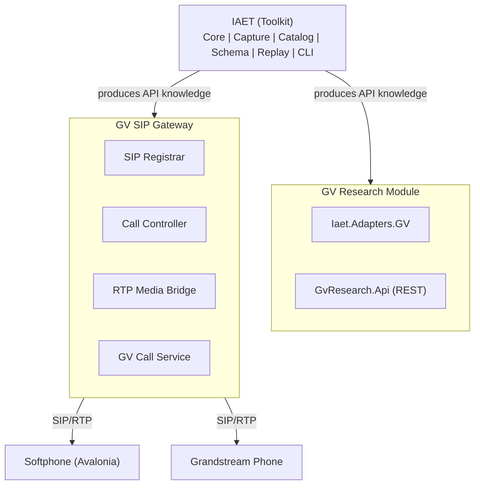
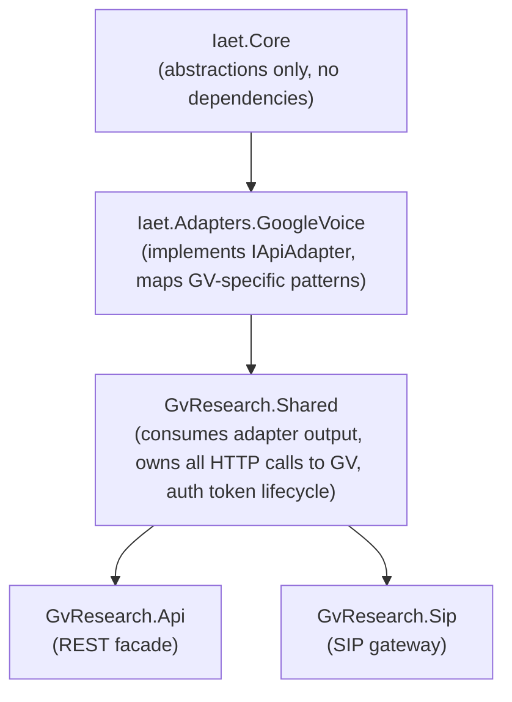

# GV Research Platform — Design Specification

**Version:** 1.0 | **Date:** 2026-03-25 | **Status:** Draft

## 1. Summary

This spec extends the GV Research Platform PRD (gv-research-plan.md) with a SIP telephony layer. The system has three components plus two client applications:

1. **IAET** — a general-purpose, target-agnostic toolkit for capturing, cataloging, replaying, and documenting undocumented browser-based internal APIs.
2. **GV Research Module** — a concrete application of IAET targeting Google Voice, producing an educational REST facade.
3. **GV SIP Gateway** — a SIPSorcery-based SIP registrar and RTP media bridge that exposes Google Voice as a standard SIP service.
4. **Desktop Softphone** — an Avalonia UI cross-platform SIP softphone with NAudio for local audio.
5. **Grandstream Hardware Phone** — a standard SIP device that registers to the gateway (no custom code needed).

All original PRD requirements (legal, ethical, technology stack, testing, NFRs) remain in effect. This spec documents the architectural additions and the implementation strategy.

## 2. Architecture



**Key relationships:**
- IAET is fully target-agnostic. It captures and documents APIs. Zero Google Voice code in core assemblies.
- The GV Research Module consumes IAET's output and wraps it in a REST facade.
- The GV SIP Gateway consumes the same GV API knowledge but exposes it as a SIP service.
- Both the REST facade and SIP gateway share GV interaction code via `GvResearch.Shared`.
- The softphone and Grandstream are plain SIP clients — they know nothing about Google Voice.

## 3. New/Modified Assemblies

| Assembly | Purpose |
|---|---|
| `GvResearch.Shared` | Shared GV API client code — HTTP calls to GV internal endpoints, auth token management, request/response models. Consumed by both the REST facade and SIP gateway. |
| `GvResearch.Sip` | SIP gateway: SIPSorcery-based SIP registrar, call controller, RTP media bridge. |
| `GvResearch.Softphone` | Avalonia UI desktop softphone with NAudio for local audio I/O. |

All original IAET assemblies (Core, Capture, Catalog, Schema, Replay, Cli, Adapters.GoogleVoice) and GvResearch assemblies (Api, Client.Cli) remain as defined in the PRD.

### 3.1 Dependency Chain



**Boundary rules:**
- `Iaet.Adapters.GoogleVoice` owns the mapping between raw captured GV endpoint patterns (Protobuf fields, RPC-style URLs) and normalized domain models. It has no HTTP client code — it produces endpoint descriptors and request/response shapes.
- `GvResearch.Shared` owns all live HTTP interaction with GV's internal APIs. It uses `IHttpClientFactory` (REQ-TECH-005) to make calls, uses adapter output to know what to call and how to format requests, and manages auth tokens. It exposes service interfaces (`IGvCallService`, `IGvSmsService`, `IGvVoicemailService`) consumed by downstream assemblies.
- `GvResearch.Api` depends on `GvResearch.Shared` and wraps its services in REST endpoints. It does NOT make direct HTTP calls to GV.
- `GvResearch.Sip` depends on `GvResearch.Shared` and calls its services for call control. It does NOT make direct HTTP calls to GV.
- `GvResearch.Softphone` has NO dependency on `GvResearch.Shared` or any GV code. It is a pure SIP client.

## 4. GV SIP Gateway Design

### 4.1 SIP Registrar

- SIPSorcery `SIPTransport` listening on UDP/TCP port 5060 (configurable via appsettings).
- Accepts REGISTER requests from SIP devices.
- Maintains an in-memory registration table mapping SIP URIs to contact addresses.
- Single-tenant: only devices with configured auth credentials can register (SIP digest authentication).
- No external SIP trunking — closed local registrar.

### 4.2 Call Controller

- **Outbound calls (SIP INVITE from device):** Extract destination number from SIP URI → call `IGvCallService.InitiateCallAsync()` → send 100 Trying → on GV ringing send 180 Ringing → on GV answer send 200 OK with SDP → bridge RTP.
- **Inbound calls (GV receives call):** Detect via `IGvCallService.ListenForEventsAsync()` → generate SIP INVITE to registered device(s) → on SIP answer bridge RTP → on GV hangup or SIP BYE tear down both legs.
- Maintains a `CallSession` object per active call tracking both the SIP dialog and GV call state.
- Graceful teardown: BYE from either side terminates both legs.

### 4.2.1 Inbound Call Detection

The mechanism for detecting inbound GV calls is unknown until IAET capture reveals it. Possible transports:

1. **Polling** — periodic HTTP GET to a GV status/events endpoint. Simple but adds latency (1-3s polling interval).
2. **WebSocket / Server-Sent Events** — GV's web client may use a persistent connection for real-time notifications. Preferred if available.
3. **Push notification relay** — GV may rely on Firebase Cloud Messaging. Would require intercepting and relaying push events.

The `ListenForEventsAsync()` method abstracts this behind `IAsyncEnumerable<GvCallEvent>`, so the SIP gateway is insulated from the transport choice. The implementation will be determined during Phase 1 capture sessions.

**Inbound call detection is a Phase 1 risk gate** — if no reliable detection mechanism is found, inbound call support (Phase 3) will be descoped and the gateway will be outbound-only.

```csharp
// Event model (tentative — refined after IAET capture)
public record GvCallEvent(
    string GvCallId,
    GvCallEventType EventType,
    string? RemoteNumber,
    DateTimeOffset Timestamp
);

public enum GvCallEventType
{
    IncomingRing,
    Answered,
    Ended,
    Missed,
    VoicemailStarted
}
```

### 4.3 RTP Media Bridge

- Creates two RTP endpoints per call: one facing the SIP device, one facing GV's audio stream.
- Codec negotiation via SDP: supports G.711 u-law (PCMU) and G.711 A-law (PCMA) at minimum.
- Bridges audio packets between the two legs with minimal latency.
- GV audio transport is unknown until IAET capture reveals it. See Section 4.3.1 for scenario analysis.

### 4.3.1 Audio Transport Scenarios

GV's audio transport will be discovered during IAET capture (Phase 1). The design must accommodate multiple possibilities:

| Scenario | Likelihood | Mitigation |
|---|---|---|
| **Standard WebRTC** (SRTP + ICE/STUN/TURN) | High | SIPSorcery has native WebRTC support. Happy path — `IGvAudioChannel` wraps a SIPSorcery `RTCPeerConnection`. |
| **WebRTC with Google-specific extensions** (custom SRTP parameters, proprietary ICE candidates) | Medium | May require custom RTP packet handling or patching SIPSorcery. Investigate during Phase 1, budget extra time in Phase 2 if detected. |
| **Non-WebRTC streaming** (HTTP chunked audio, gRPC audio stream, proprietary binary) | Low | Cannot use SIPSorcery's WebRTC layer. Would need a custom `IGvAudioChannel` that transcodes between the proprietary stream and RTP. Significant additional work — if detected, Phase 2 scope narrows to signaling only (no audio bridge) and audio bridging moves to Phase 3. |
| **No accessible audio transport** (audio handled entirely in browser sandbox with no interceptable stream) | Low | SIP audio bridging is not feasible. Pivot to call-control-only gateway (initiate/hangup via SIP, audio stays in GV web client). Document findings as research output. |

### 4.4 GV Audio Channel Abstraction

The GV-side audio handling is isolated behind an interface to accommodate the unknown audio transport:

```csharp
public interface IGvAudioChannel
{
    Task<RtpSession> EstablishAudioAsync(string gvCallId, CancellationToken ct);
    Task HangupAsync(string gvCallId, CancellationToken ct);
}
```

This interface lives in `GvResearch.Sip` (not Shared) because it returns SIPSorcery's `RtpSession` type. It will be implemented once IAET capture reveals GV's actual audio protocol.

### 4.5 GV Call Service (in GvResearch.Shared)

```csharp
public interface IGvCallService
{
    Task<GvCallResult> InitiateCallAsync(string destinationNumber, CancellationToken ct);
    Task<GvCallStatus> GetCallStatusAsync(string gvCallId, CancellationToken ct);
    Task HangupAsync(string gvCallId, CancellationToken ct);
    IAsyncEnumerable<GvCallEvent> ListenForEventsAsync(CancellationToken ct);
}
```

- Wraps HTTP calls to GV's internal API endpoints (discovered via IAET).
- Auth token injection from secure local config (dotnet user-secrets).
- Enforces rate limits per REQ-LEGAL-004 (10 req/min, 100 req/day).

### 4.6 Auth Token Lifecycle

The REST facade (`GvResearch.Api`) and SIP gateway (`GvResearch.Sip`) run as **separate processes** (separate executables, separate containers in docker-compose). They share GV auth tokens via a common mechanism:

- **Token storage:** GV auth tokens (cookies/OAuth tokens captured during IAET sessions) are stored in an encrypted local file (AES-256, per REQ-LEGAL-003). Path configured via appsettings, default: `~/.gvresearch/tokens.enc`.
- **Token service:** `GvResearch.Shared` provides an `IGvTokenService` that reads from the encrypted store, caches in-memory, and handles refresh when tokens expire.
- **Both processes** instantiate their own `IGvTokenService` reading the same file. File locking ensures safe concurrent access.
- **Token refresh:** If GV uses session cookies with expiry, the token service will re-authenticate using stored credentials. The refresh mechanism will be determined during IAET capture (Phase 1). If tokens require manual browser re-authentication, the system logs a warning and the `iaet capture` command is used to obtain fresh tokens.

```csharp
public interface IGvTokenService
{
    Task<string> GetValidTokenAsync(CancellationToken ct);
    Task RefreshTokenAsync(CancellationToken ct);
    event EventHandler<TokenExpiredEventArgs>? TokenExpired;
}
```

- **REQ-SHARED-002:** Auth tokens must be managed by `IGvTokenService` in `GvResearch.Shared`, supporting concurrent access from multiple processes via file locking and in-memory caching.

### 4.7 Error Handling and SIP Failure Mapping

When GV-side operations fail, the SIP gateway must translate failures into appropriate SIP responses:

| GV Failure | SIP Response | Notes |
|---|---|---|
| Auth token expired / invalid | 503 Service Unavailable | Log warning, trigger token refresh |
| GV rate limit exceeded | 503 Service Unavailable + Retry-After | Per REQ-LEGAL-004 |
| GV call initiation failed | 502 Bad Gateway | GV rejected the call attempt |
| Destination number invalid | 404 Not Found | Number format rejected by GV |
| GV timeout (no response in 30s) | 504 Server Timeout | |
| GV audio channel setup failed | 488 Not Acceptable Here | SDP/media negotiation failure |
| Internal error | 500 Server Internal Error | Catch-all with structured logging |

All SIP error responses include a Reason header with a human-readable description. All failures are logged at Warning or Error level with correlation IDs linking the SIP dialog and GV call ID.

## 5. Desktop Softphone Design

### 5.1 UI (Avalonia)

Single-window app with three views:
- **Dialer** — number pad, destination input, call/hangup buttons.
- **Active Call** — call timer, mute/hold/hangup controls, audio level indicators.
- **Call Log** — recent calls with direction, number, duration, timestamp.

### 5.2 Audio (NAudio)

- NAudio for audio capture (microphone) and playback (speaker).
- Cross-platform: NAudio supports Windows natively; Linux/macOS via ALSA/PulseAudio abstractions. PortAudioSharp is a fallback if NAudio cross-platform support is insufficient (risk to validate during the slice).
- Audio device selection in settings.
- Default sample rate: 8kHz for G.711 compatibility.

### 5.3 SIP (SIPSorcery as SIP User Agent)

- REGISTER to the SIP gateway.
- INVITE / BYE for call control.
- RTP send/receive for audio.
- SDP negotiation: offers PCMU/PCMA.

### 5.4 Configuration

Local JSON settings file:
- SIP gateway address/port
- SIP credentials (username/password)
- Audio device preferences
- Display name / caller ID

### 5.5 Scope Boundaries

The softphone is NOT:
- A GV client — it's a generic SIP softphone.
- A full-featured PBX phone — no transfer, conference, BLF. Just dial, answer, mute, hold, hangup.

## 6. Updated Solution Structure

```
gv-research/
  src/
    Iaet.Core/                        # Shared abstractions/contracts
    Iaet.Capture/                     # Playwright CDP capture engine
    Iaet.Catalog/                     # SQLite endpoint catalog
    Iaet.Schema/                      # Schema inference engine
    Iaet.Replay/                      # HTTP replay engine
    Iaet.Cli/                         # dotnet tool CLI
    Iaet.Adapters.GoogleVoice/        # GV-specific adapter
    GvResearch.Shared/                # GV API client, models, auth
    GvResearch.Api/                   # ASP.NET Core REST facade
    GvResearch.Sip/                   # SIP gateway
    GvResearch.Softphone/             # Avalonia desktop softphone
    GvResearch.Client.Cli/            # Example CLI client
  tests/
    Iaet.Core.Tests/
    Iaet.Catalog.Tests/
    Iaet.Schema.Tests/
    Iaet.Replay.Tests/
    GvResearch.Shared.Tests/
    GvResearch.Api.Tests/
    GvResearch.Sip.Tests/
    GvResearch.Softphone.Tests/
  docs/
    gv-research-plan.md
    api-catalog.md
  captures/                           # gitignored - real session data
  scripts/
    build.ps1
    docker-compose.yml
  Directory.Build.props
  global.json
  GvResearch.sln
```

## 6.1 Test Strategy for New Assemblies

All existing PRD testing requirements (REQ-TECH-011 through REQ-TECH-013) apply to new assemblies. Additional guidance:

| Assembly | Test Approach | Coverage Target |
|---|---|---|
| `GvResearch.Shared` | Unit tests with NSubstitute mocks for `IHttpClientFactory`. Integration tests against a mock HTTP server (WireMock.Net) simulating GV endpoint responses. Token service tested with temp file I/O. | 70% line coverage |
| `GvResearch.Shared.Tests` | Standard xUnit + FluentAssertions per PRD. | — |
| `GvResearch.Sip` | Unit tests for call controller logic (SIP state machine, failure mapping) with mocked `IGvCallService` and `IGvAudioChannel`. Integration tests using SIPSorcery's `SIPTransport` in loopback mode to verify SIP registration and INVITE flows without hardware. RTP bridge tested with synthetic audio packets. | 70% for call controller and registrar; RTP bridge excluded from coverage target (hardware-dependent). |
| `GvResearch.Sip.Tests` | xUnit + FluentAssertions + NSubstitute. SIPSorcery loopback for SIP integration tests. | — |
| `GvResearch.Softphone` | ViewModel unit tests (MVVM pattern — logic in ViewModels, not code-behind). Avalonia Headless test mode for UI rendering verification. Audio engine excluded from automated tests (hardware-dependent). | 70% for ViewModels; UI and audio layers excluded from coverage target. |
| `GvResearch.Softphone.Tests` | xUnit + FluentAssertions. Avalonia.Headless for UI tests. | — |

**Note:** The PRD's solution structure omits `Iaet.Capture.Tests` and `Iaet.Cli.Tests`. These are excluded because capture tests require a live browser (integration-only, run manually) and CLI tests are covered by end-to-end test scripts in `scripts/`. If unit-testable logic emerges in these assemblies, test projects will be added.

## 7. Vertical Slice: "One Outbound Call, End to End"

The first implementation milestone proves the entire architecture by making one phone call from the softphone through to Google Voice.

### 7.1 Slice Scope

| Layer | Built in Slice | Deferred |
|---|---|---|
| **IAET** | Core contracts, Capture (Playwright CDP), Catalog (SQLite), CLI (`capture` + `catalog` commands) | Schema inference, Replay, Export, Annotation |
| **GV Adapter** | Call-related endpoint mapping only | SMS, Voicemail mapping |
| **GvResearch.Shared** | GV call initiation API client, auth token management | SMS/Voicemail services |
| **GvResearch.Api** | `GET /api/v1/calls` (history), `POST /api/v1/calls` (initiates a real GV call via `IGvCallService` — call audio is NOT handled by the REST facade; use the SIP gateway for audio) | Full CRUD, SMS, Voicemail, pagination, analytics |
| **GvResearch.Sip** | SIP registrar, INVITE/BYE handling for outbound calls, RTP bridge, `IGvAudioChannel` implementation | Inbound calls, hold, mute at gateway level |
| **Softphone** | Dialer view, active call view, basic audio, SIP registration | Call log, settings UI, hold/mute UI |
| **Infra** | Directory.Build.props, solution scaffolding, build.ps1 (build+test targets) | Docker, CI/CD, Prometheus, health checks |

### 7.2 Slice Success Criteria

1. `iaet capture` records call-related GV traffic in a browser session.
2. Captured endpoints are cataloged in SQLite.
3. Softphone registers to the SIP gateway.
4. User dials a number on the softphone → call is placed via GV → audio flows both directions.
5. Either side hangs up → both legs tear down cleanly.

## 8. Implementation Strategy

**Approach:** Plan first → vertical slice → expand.

1. Create a detailed implementation plan from this spec (next step).
2. Build the vertical slice (Phase 1-2 in timeline).
3. Adjust requirements and plans based on what we learn — especially around GV's audio transport.
4. Expand to full system coverage.

## 9. Updated Timeline

> **Note:** This timeline supersedes the PRD Section 9 timeline. The original 16-week schedule is extended to 19 weeks to accommodate the SIP gateway and softphone scope additions.

| Phase | Weeks | Focus |
|---|---|---|
| **0 — Planning** | 1-2 | Finalize spec, create implementation plan, research GV audio transport, repo scaffolding |
| **1 — IAET Foundation** | 3-5 | Iaet.Core, Capture, Catalog, Cli. First GV capture sessions — discover call endpoints and audio transport. |
| **2 — Vertical Slice** | 6-9 | GvResearch.Shared, GV adapter (calls), SIP gateway, softphone, REST API (calls). **Milestone: one outbound call works end-to-end.** |
| **3 — Expand Telephony** | 10-12 | Inbound calls, hold/mute, call log, Grandstream testing, Schema inference, Replay engine. |
| **4 — SMS and Voicemail** | 13-16 | SMS/voicemail adapter + REST endpoints, `infer`/`replay`/`export` CLI commands, educational example clients (PRD Examples A-D). |
| **5 — Polish** | 17-19 | Docker, CI/CD, health checks, metrics, code coverage, non-GV IAET demo, final documentation, retrospective. |

### Educational Example Clients (PRD Section 7)

The PRD requires three educational REST facade consumers plus an IAET demo. These remain in scope:
- **Example A (Blazor voicemail dashboard)** — Phase 4, after voicemail API is complete.
- **Example B (SMS CLI tool)** — Phase 4, after SMS API is complete.
- **Example C (Call analytics + Chart.js)** — Phase 4, after full call history API is complete.
- **Example D (IAET on non-GV target)** — Phase 5, as part of the final documentation and demo.

The softphone is NOT counted as an educational example — it is a first-class component, not a REST facade consumer.

### Risk Gates

- **End of Phase 1:** Do we understand GV's audio transport? If exotic, Phase 2 scope adjusts per Section 4.3.1. Also: is there a reliable inbound call detection mechanism? If not, inbound calls are descoped (Section 4.2.1).
- **End of Phase 2:** Does the outbound call work? If GV's internal API is too fragile, reassess the SIP gateway approach.

## 10. Technology Choices (New)

| Concern | Choice | Rationale |
|---|---|---|
| SIP/RTP stack | SIPSorcery | Mature C# library, keeps everything in .NET, supports SIP UA + server + WebRTC |
| Desktop UI | Avalonia UI | Cross-platform (Win/Linux/macOS), WPF-like API, most mature option for .NET desktop |
| Local audio | NAudio | Established .NET audio library. PortAudioSharp as cross-platform fallback. |
| GV API interaction | IHttpClientFactory + GvResearch.Shared | Per PRD REQ-TECH-005. Shared between REST facade and SIP gateway. |
| Mock HTTP server (tests) | WireMock.Net | Used in GvResearch.Shared.Tests for simulating GV endpoint responses. |

## 11. Requirements Traceability

All original PRD requirements (REQ-LEGAL-*, REQ-TECH-*, REQ-IAET-*, REQ-GV-*, REQ-NFR-*) remain unchanged. The following are new requirements introduced by this spec:

- **REQ-SIP-001:** The SIP gateway must accept SIP REGISTER and authenticate via digest auth.
- **REQ-SIP-002:** The SIP gateway must handle outbound calls (INVITE from device → GV call initiation → RTP bridge).
- **REQ-SIP-003:** The SIP gateway must handle inbound calls (GV incoming → INVITE to registered devices → RTP bridge).
- **REQ-SIP-004:** RTP media bridge must support G.711 PCMU and PCMA codecs at minimum.
- **REQ-SIP-005:** The SIP gateway must run on the same host as the REST facade (single-machine deployment for research use). In Docker, this means separate containers in the same docker-compose stack on the same host, with the SIP container using `network_mode: host` for SIP/RTP port accessibility.
- **REQ-SOFT-001:** The softphone must be a cross-platform Avalonia application supporting Windows and Linux at minimum.
- **REQ-SOFT-002:** The softphone must support basic call operations: dial, answer, hangup, mute, hold.
- **REQ-SOFT-003:** The softphone must use local audio devices (microphone + speaker) via NAudio or equivalent.
- **REQ-SHARED-001:** GV API client code used by both the REST facade and SIP gateway must live in GvResearch.Shared to avoid duplication.
- **REQ-SHARED-002:** Auth tokens must be managed by `IGvTokenService` in `GvResearch.Shared`, supporting concurrent access from multiple processes via file locking and in-memory caching.
- **REQ-SIP-006:** SIP credentials must be stored in appsettings (username/realm) with passwords in dotnet user-secrets, separate from the GV auth tokens and REST facade bearer token.
- **REQ-SIP-007:** The SIP registrar must support multiple concurrent SIP registrations (e.g., softphone + Grandstream) under a single tenant, distinguished by SIP URI.
- **REQ-SIP-008:** The SIP gateway must apply PRD REQ-NFR-003 resilience patterns (Polly retry + circuit breaker) to all outbound HTTP calls to GV via `GvResearch.Shared`.
- **REQ-SIP-009:** The SIP gateway must log call setup/teardown events at Information level and RTP statistics at Debug level, using the same Serilog infrastructure as the REST facade (REQ-TECH-006).
- **REQ-SIP-010 (DTMF):** DTMF relay support (RFC 2833 / SIP INFO) is deferred to Phase 3. The vertical slice does not support IVR interaction or touch-tone input.
